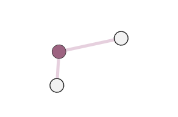
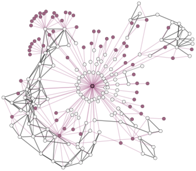

# Welcome to NetworkCurator!

NetworkCurator is an open-source web application. It helps you manage and annotate data
through graph structures in a collaborative manner. 

  

    

       

      

        <h4>Build a custom network</h4>        
      

    

  

  

    

      

      

        <h4>Annotate network components</h4>
      

    

  

  

    

      

      

        <h4>Collaborate with team members to expand the network</h4>        
      

    

  

Whether you want to learn [how to use](user/index.html) the app or [how it works](developer/index.html) under the hood, this documentation covers a wide range of topics. 
