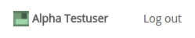

# User accounts

User accounts are created by the site [administrator](admin.html). 

To update personal details and change passwords for an existing account, log in and navigate to the the user accounts page. It is available by clicking the user name or user icon in the top-right corner, for example

Once on the accounts page, use the form to update the relevant fields.

