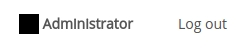

# Site Administration

After installation, the site is empty: there are no networks. However, the installation script creates one user with user name `admin`, the administrator user. 

The role of the administrator is to monitor user accounts and networks. To perform these tasks, navigate to the administrator account page by clicking on the username in the top-right corner of a page.

On the admin account page, you will see a section with site management options.

## User accounts

To create a user account, fill in the registration form with a user information and password. After submitting the form, you should see a confirmation message. The user account should become immediately accessible. 

After initial registration, users can change their password at any time through their own [account page](accounts.html). 

## Networks

There are two mechanisms to create a new network. 

 - The simplest way is 'From scratch'. This procedure creates a blank network without any ontology or graph structure. Just enter a network name, network title, and brief description in the form and submit the form. 

 - The second procedure is 'From file'. This can be useful to create a filled network in one step. Select the file containing the network definition and submit the form. 

In both procedures, the new network will become immediately active and should appear on the administrator's front page (upon refresh). The new network, however, will not be visible or accessible to any of the other registered user or site visitors. To change the visibility, you must edit the network [permissions](permissions.html).
