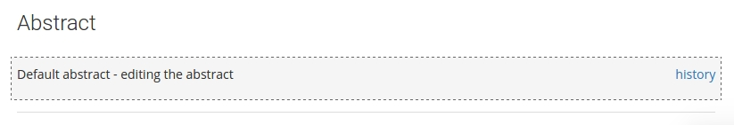

# Annotations

The NetworkCurator platform allows you to annotate individual nodes, links, as well 
as networks as a whole. This is achieved by coupling a content-management system 
to each graph component. 

 - <a href="#content">Content types</a>
 - <a href="#editing">Editing annotations</a>
 - <a href="#techniques">Editing techniques</a>
 - <a href="#history">Annotation history</a>
 - <a href="#other">Other annotations</a>

## Content types

Objects in the NetworkCurator database are associated with at least four annotation types: a name, a title, an abstract, and a content field. 

<table class="table">
<tr><th>Annotation</th><th>Description</th></tr>
<tr><td>Name</td><td>Short unique identifier, e.g. TP53 in a gene network; restricted to characters [0-9,a-z,A-Z,_,-]</td></tr>
<tr><td>Title</td><td>Longer but concise name for the object; appears on graph page during previews</td></tr>
<tr><td>Abstract</td><td>Short description; appears on graph page during previews</td></tr>
<tr><td>Content</td><td>Complete description for the object; only appears on dedicated content pages.</td></tr>
</table>

These descriptors are associated with individual nodes, links, and ontology classes. 
You can see these fields associated with a node or a link by selecting an object on [graph page](graphs.html) and the clicking 
the "Read more" button. 

## Editing a network annotation

Let's look at annotation editing through an example. Suppose we navigate to a page with an uninformative abstract. 

Let's change this. Click on the editing pen icon near the top-right corner of the page.

If you have editing or curation [permissions](permissions.html), the page should indicate the elements that are editable through a change of background and border. 

Click on the text in the above box. The area will change into an editable box with buttons. 

Modify the contents of the abstract. Use the Preview/Edit buttons to toggle between the editable text and an html preview. Use the 'close' link to abandon editing. Or use the 'Submit' button to save the new content in the database.

## Types of content

Each annotation is encoded in plain text in the NetworkCurator database. However, there are means to add styling to create rich, even dynamic, content.

### HTML

Content fields can be styled with standard HTML. For example, you can emphasize text using <code>&lt;b&gt;</code> tags. 

{:.p-warning}
Annotation text is 'sanitized' before it is displayed during preview. 
Thus, some html tags and attributes may be removed.

### Markdown

Markdown is a markup language that augments plain-text documents with simple styling, for example headers or web-links. The implementation used in NetworkCurator is based on [showdown](https://github.com/showdownjs/showdown) and supports:

- paragraph structure,
- text styling (bold, italic, strikethrough text),
- links,
- headers,
- lists,
- checklists,
- tables,
- code blocks.

See the showdown [documentation](https://github.com/showdownjs/showdown/wiki/Showdown's-Markdown-syntax) for details.

### Makealive

Annotation boxes also support data-driven content through the [makealive](https://tkonopka.github.io/makealive/) system. 
Use this technology to transform plain-text data into dynamic visualizations through a library of ready-made conversion functions:

 - bar plots (vertical and horizontal),
 - scatter plots,
 - venn diagrams.

To include a makealive component as part of a graph annotation, prepare a makealive code snippet and paste it into the annotation text area. The [sandbox pages](sandboxes.html) can help with creating these snippets.

## Annotation history

All annotations updates (versions) are recorded in a database. To see the annotation history, click the 'film' icon near the top-right corner of a page. 

The page should indicate where the annotation boxes are through a change of background and border. 

Click on the 'history' link to navigate onto a new page with details on all the recorded updates. 

## Other annotations

Pages that display annotations for nodes and links contain a toolbar whereby you can
also adjust the object name, ontology class, and object ownership. 

To adjust these properties, click on the editing pen icon in the top-right corner. 
The toolbar buttons will become active; clicking a button will display a dropdown form 
with a text box and submit button. 

 - Assigning a new name to an object changes the label that is associated with a node or link
on the graph page. A new name will be accepted if and only if there does not already exist
an object with that name.

 - A new class will only be accepted if it has been defined on the [ontology](ontologies.html) page. 

 - Object ownership can be transferred only to an existing user who has editing or curating 
[permissions](permissions.html) for the given network.

{:.p-warning}
Object names, classes, and owner ids must be strings using the characters [A-Z,a-z,0-9,_,-] only.

