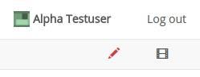

# Annotations

A defining feature of the NetworkCurator platform is annotation of nodes, links, and entire networks. This is achieved by coupling a content-management system to each graph component. 

## Content types

Most objects in the NetworkCurator database are associated with at least four annotation types: a name, a title, an abstract, and a content field. 

<table class="table">
<tr><th>Annotation</th><th>Description</th></tr>
<tr><td>Name</td><td>Short unique identifier, e.g. TP53 in a gene network; restricted to characters [0-9,a-z,A-Z,_,-]</td></tr>
<tr><td>Title</td><td>Longer but concise name for the object; appears on graph page during previews</td></tr>
<tr><td>Abstract</td><td>Short description; appears on graph page during previews</td></tr>
<tr><td>Content</td><td>Complete description for the object; only appears on dedicated content pages.</td></tr>
</table>

Each network as a whole carries all these descriptors. As is common in repositories of network data, these descriptors appear on the network summary page.

On the NetworkCurator platform, these descriptors are also associated with nodes, links, and ontology classes. These can be reached from the [graph page](graphs.html).

## Editing a network annotation

Let's look annotation editing through an example. Suppose we navigate to a page describing a network node and notice an uninformative abstract. 

Let's change this. Click on the editing pen icon near the top-right corner of the page.

If you have editing or curation [permissions](permissions.html), the page should indicate the elements that are editable through a change of color and border. 

Click on the text in the above box. The representation will change into an editable box with buttons. 

Use this text area to modify the contents of the abstract. Use the Preview/Edit buttons to toggle between the editable text and a preview. Use the 'close' link to abandon editing. Or use the 'Submit' button to save the new content in the database.

## Editing techniques

Each annotation is encoded in plain text in the database. However, there are means to add styling to create rich, even dynamic, content.

### HTML

Content fields can be styled with simple HTML tags. For example, it is possible to emphasize text using <code>&lt;b&gt;</code> tags. Note, however, that HTML input is sanitized before it is displayed during preview. Thus, some tags and attributes may be removed.

### Markdown

Markdown is a markup language designed to augment plain-text documents with simple styling, for example headers or web-links. The implementation used in NetworkCurator is based on [showdown](https://github.com/showdownjs/showdown) and provides the following features

- paragraph structure
- text styling (bold, italic, strikethrough text)
- links
- headers
- lists
- checklists
- tables
- code blocks

See the showdown [documentation](https://github.com/showdownjs/showdown/wiki/Showdown's-Markdown-syntax) for details on these features.

### Makealive

Content fields also support data-driven content through the [makealive](https://tkonopka.github.io/makealive/) manager. This technology enables transforming plain text data into dynamic visualizations through a library of ready-made conversion functions. 

Supported makealive functions include those to generate 

 - bar plots (vertical and horizontal)
 - scatter plots
 - venn diagrams

To include a makealive component as part of a graph annotation, just prepare the relevant makealive code snippet and paste it into the annotation text area. See the [sandbox pages](sandboxes.html) for help with creating makealive code snippets.

