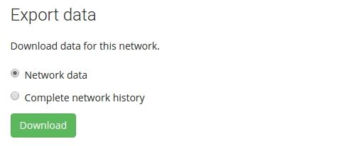

# Data export

At various stages of a project you may want to export data from the NetworkCurator database to use locally or deposit into a data archive such as [Figshare](https://figshare.com/) or [Zenodo](https://zenodo.org/). 

On the navigation tab, select the 'Data' tab. The export section should be at the top. 

There are several download options which provide different detail of the data.

<table class="table">
<tr><th>Download type</th><th>Description</th></tr>
<tr><td>Network data</td><td>Current state1 of the network; includes network summary, ontology, nodes, and links</td></tr>
<tr><td>Comments</td><td>Same as network data plus user comments</td></tr>
<tr><td>Complete2 annotation history</td><td>Complete export of all network database records</td></tr>
</table>

 1 The current state of the network includes objects with active and inactive status.

The output from the data export is a file in json format. The first two export types provide files that can be re-[imported](dataimport.html) into a NetworkCurator instance.

{:.p-warning}
The NetworkCurator database keeps track of object ownership, and the output files contain fields to convey this information. Note, however, that object ownership is not preserved when a network is imported into a new database or a new network in the same database. 
