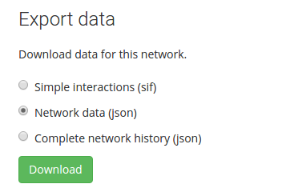

# Data export

At various stages of a project you may want to export data from the NetworkCurator to use locally or deposit into a data archive such as [Figshare](https://figshare.com/) or [Zenodo](https://zenodo.org/). 

On the navigation tab, select the 'Data' tab. The export section should be at the top. 

The download options provide increasing level of detail. 

## Simple interactions (sif)

The simplest export type provides output in the [simple interaction format](http://wiki.cytoscape.org/Cytoscape_User_Manual/Network_Formats). This is a plain-text encoding of links between nodes. 

**Advantage:** SIF is recognized by third-party graph viewers such as [Cytoscape](http://www.cytoscape.org/). 

**Disadvantage:** SIF removes information about node types. It also removes all annotations associated with the network components.

{:.p-note}
This export type only outputs active nodes and links.

## Network data (json)

The option marked as 'network data' provides a file in a json encoding. The format is described on the [data import](dataimport.html) documentation. It includes summary data about the network as a whole, ontologies, all nodes, and all links.

**Advantage:** The format is native to the NetworkCurator. You can therefore download a network, edit the file slightly, and then re-upload the modified file to update the existing network or to create a new one.

**Disadvantage:** The format contains more information than is recognized by third-party network viewers. Therefore, you will have to reformat the data to import the graph into a third-party viewer.

{:.p-note}
The network data export includes some fields such as `class_id` or  `node_id` that are used internally by the database. These fields are not used during a re-import. 

## Complete network data (json)

The last export option is marked as 'complete network data'. This too provides output in json format. The content is a dump of data in the NetworkCurator database associated with the network, including complete annotation history and user comments.

**Advantage:** This option provides a backup of all network data.

**Disadvantage:** The download file can be subtantially larger than the simpler network download.

{:.p-note}
The complete network data format contains information about object ownership. However, object ownership is not preserved when a network is re-imported.

