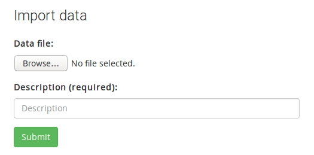
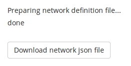

# Network import


Whereas the web interface provides tools for creating and editing individual graph objects, it is sometimes useful to make several changes at once. These actions can be performed through data imports. 

On the navigation bar, select the tab `Data` and look for the data import section. 



Select a data file on your local computer, write in a short description for the upload, and click Submit. After a brief moment, you will see a summary of the changes performed or some error messages.

You will have to prepare a network definition file in JSON format. The rest of this section explains the required format and describes some tools to help prepare such files. 

- [Network definition file format]("#netjson")
- [Preparing network definitions with R]("#netr")
- [Preparing network definitions with a sandbox]("#netsandbox")
- [Importing network definitions]("#netimport")


<a name="netjson"></a>

## Network definition files

A network definition is a JSON text file with the following structure.

```
{
  "network":  [...], 
  "ontology": [...],
  "nodes":    [...],
  "links":    [...]
}
```

Let's now look into each of these block in turn. (Even if you decide to prepare a network definition file with the cut-and-paste sandbox method, it is worth skimming this documentation as the format is quite flexible and not all elements are required.) 
 

### Network block 

The first block called `network` is **required**. It identifies the target network and sets its summary attributes.

```
"network": [
  {
    "name":     "net-example",
    "title":    "Import tutorial network",
    "abstract": "Tutorial abstract",
    "content":  "Tutorial text"
  }
]
```

The first attribute `name` is **required** and its value should match the name of the existing network. 

The other attributes are optional. If they are present, they are interpreted as updates for the existing values. (If they are omitted, existing values in the database will stay unchanged). The title and abstract fields appear on the front page. The content field is the main body of text of the network summary page.

**Note:** It is important that the `network` block is a JSON array with one element. That is, it is important that the key/value pairs are enclosed by brackets as well as braces, `[{ ... }]`. Definitions beyond the first position in the array are ignored.


### Ontology block

Ontology definitions define the types of nodes and links in the network. 

```
"ontology": [
  {
    "name":        "NODE_A",
    "connector":   0,
    "directional": 0,
    "parent":      "",
    "status":      1
  },
  {
    "name":        "LINK_X",
    "connector":   1,
    "directional": 1,
    "parent":      "",
    "status":      1
  }
]
```

The JSON array can contain multiple entries. Each entry describes either a node or a link class. 

- `name`, alphanumeric string without spaces or special characters. Sets the name identifier for the class. 
- `connector`, 0/1 value. Determines whether the class is a node or link.
- `directional`, 0/1 value. Determines if a link is two-way or one-way.
- `parent`, alphanumeric string, identifies the parent class in the hierarchy and should match a defined class. Defaults to the empty string, which places the class at the root level in the hierarchy.
- `status`, 0/1 value. Determines if a class is deprecated or active.

The `name` attribute in each entry is **required**. When the named class does not exist in the network, it is created. When the named class already exists, the definitions are used to change its properties. Definitions that match existing values are ignored.

**Note:** Attributes other than `name` are not required. However, they default to the values shown for nodes and links, respectively. Thus, a missing attribute for an existing ontology class can trigger an update. 

**Warning:** Updating ontology classes is tricky, especially when there is a nontrivial hierarchy structure involved. In most cases it is best to use the import features only to define new root-level classes. Adjustments/updates are more easily made through the web interface. 


### Nodes block

Node definitions define the vertices in the network graph and, along with link defintions, usually form the bulk of a network definition file.


```
"nodes": [
  {
    "name":  "n001",
    "title": "test node 001",
    "class": "NODE_A",
    "status": 1
  },
  {
    "name":  "n002",
    "title": "test node 002",
    "class": "NODE_A", 
    "status": 1
  }
]
```

The JSON array can contain multiple entries, each of which described by the following properties.

- `name`, alphanumeric string without spaces or special characters. Sets a unique identifier for the node and appears on top of nodes in the graph visualization.
- `title`, alphanumeric string that may contain spaces or special characters. 
- `class`, alphanumeric string that should match one of the defined ontology classes.
- `status`, 0/1 value. Determines if the node is inactive or active, i.e. invisible or visible by default on the graph page.


### Links block

Link definitions define what graph elements should be connected within the graph. Along with links, these definitions usually form the bulk of a network definition file.

```
"links": [
  {
    "name":   "link001",
    "title":  "test link 001",
    "class":  "LINK_X",
    "source": "n001",
    "target": "n002",
    "status": 1
  }
]
```

- `name`, alphanumerical string without spaces or special characters. Sets a unique identifier for the link.
- `title`, alphanumeric string that may contain spaces. Defaults to the link name and is 
- `class`, alphanumeric string that should match one of the ontology classes.
- `source`, alphanumeric string that should match one of the defined nodes.
- `target`, alphanumeric string that should match one of the defined nodes.
- `status`, 0/1 value. Determines if the links is inactive or active.

The `title` is optional (defaults to the link name), but all other fields are **required**.


<a name="netr"></a>

## Preparing network definitions with R

Network definition files in JSON format are easily produced programmatically from tables or data frames using R (other scripting/programming languages also provide similar tools). 

To prepare a new network in R, begin by creating data frames for each of the network, ontology, nodes, and links blocks. Then, place the four data frames into a list. An example RData object with a small network called `test_network` is available [here](files/test_network.RData).

The conversion from a list of data frames into JSON is performed using the `jsonlite` package. 
A short script is as follows

```
## load an object called netdata containing a definition of network test_network
load("test_network.RData");              
## (optional) view the loaded object 
netdata
## load the jsonlite package (install it, if necessary)
library("jsonlite")
## convert from the list of data frames into a string
netjson = prettify(toJSON(netdata));
## (optional) view the json string
netjson
## save the string into a new text file
write(netjson, file="test_network.json");
```

The output file `test_network.json` (also available [here](files/test_network.json) ) contains a complete network definition that can be used on the data import page.

**Note:** It is worth looking through the JSON file. In particular, if your data frames contain row names, these might appear as strange fields in the JSON arrays. You should try to remove these before uploading the data to the server.


<a name="netsandbox"></a>

## Preparing network definitions with a sandbox

Another means to prepare JSON network definition files is through the network sandbox. In this procedure, the conversion from tables into JSON is performed within the browser. 

The prepare a new network in the sandbox, begine by creating tables summarizing your intended ontology, node set, and link sets using a spreadsheet. Using this procedure, it is important to arrange the various data fields (names, titles, and other fields) in the order specified on the sandbox page. 

On the sandbox page, fill in the network name and title. Copy-paste tables from the spreadsheets into the appropriate text areas. 

At the bottom of the page, there should appear a summary message together with a download button. 



Click the button and download the prepared file. You can use this file directly on the data import page. 


**Note:** The JSON file extension may not be recognized by default by your operating system. But the file contain plain text and you can preview it using programs such as Edit, gedit, Write, notepad, or other standard text editors. 


