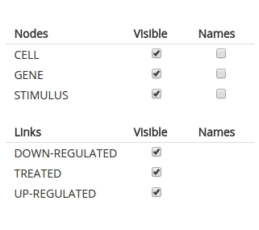

# Graphs

The graph page is the starting point for most interactions with network data. The page is empty at first and is populated with widgets and a network visualization once data are loaded from the server.

## Network view

A big part of the page is occupied by a network visualization, wherein nodes and links are displayed using a force-layout simulation. 

This area supports panning, zooming, selection, and dragging. A small toolbar on the side provides shortcuts to commonly-used features: centering the network in the visible space, zooming in and out, pausing/unpausing the force-layout simulation, saving an svg snapshot of the network, and toggling between a wide- and narrow-view.

Selecting a node or link within the visualization area highlights the object and loads a short object summary. From there, you can follow a link to read a more in-depth [annotations](annotations.html) of the object, including [comments](comments.html). 

## Toolbar

The graph toolbar at the top of the graph page provides access to several annotation and navigation features.

 - <a href="#edit">Select, New node, New link buttons</a>
 - <a href="#view">View button</a>
 - <a href="#settings">Settings button</a>
 - <a href="#save">Save button</a>
 - <a href="#search">Search box</a>

### Select, New node, New link buttons

The first three buttons are dedicated to graph editing. 

- The 'Select' button is the default interaction mode: select this button to be able to highlight or drag existing nodes in the network.

- The 'New node' button reveals a dropdown list with a summary of the [node ontology](ontologies.html). To create new node, select a node class of interest. Then, click within the network visualization to create a new (temporary) node.

- The 'New link' button works in a similar fashion, but reveals a summary from the [link ontology](ontologies.html). To create a new (temporary) link within the network, mouse-down on a source node, drag toward the target node, and release. 

{:.p-note}
New nodes and links appear with a dotted border and are only temporary. 
To commit a new object into the database, select the new node or link, edit the 
new node/link form, and press 'Create'. You need 
[editing permissions](permissions.html) to perform this action. 

{:.p-warning}
If you have editing or curating permissions, you can remove network objects from the graph. 
Removed components are marked as inactive or deprecated; they are not actually deleted permanently. To 'undo' a remove action, display all inactive objects using the graph settings, click on the network component, and press 'Activate'.

### View button

The 'View' button displays a dropdown panel with several checkboxes associated with the node and link ontology classes.

 - Uncheck the 'visible' boxes to hide some of the network components in the visualization. Focusing attention on a smaller subnetwork can help bring out distinct patterns in a sub-network. 

 - Check boxes in the 'Names' column to display text labels next to graph nodes.

### Settings button

The 'Settings' button displays a dropdown panel with graph visualization options. 
Many of the preset values are arbitrary; experiment with other values to suit your needs.

{:.p-note}
Toggling 'Inactive objects' reveals network objects that have been stored in the database, but later marked as inactive or deprecated. Use this option to track these old objects and change their status.

{:.p-note}
Settings under the 'Traversal' are coupled with the search box capabilities (see description below)

### Save button

The 'Save' button on the graph toolbar provides options to record the current visualization. 

 - Saving the network diagram results in an svg file that should be viewable in most vector-graphics software programs, for example [inkscape](https://inkscape.org). 

 - Saving the visible node list results in a text file with two columns (node name, ontology class).

{:.p-note}
For more options for saving network data, see the documentation on [data exports](dataexport.html).

### Search box

Below the graph toolbar is a box labeled 'Search'. Type a node node name into the 
search box and press 'Enter' or 'space'. The name will appear as a tag. The graph 
will rearrange to display the desired node (outlined for emphasis) together with a small
neighborhood.

The search box can be used to highlight more than one node.

{:.p-note}
You can adjust the size of the neighborhood displayed around selected nodes via
the graph settings under 'Neighborhood distance'.

{:.p-note}
Double clicking a node within the graph automatically adds that node into the search box.

