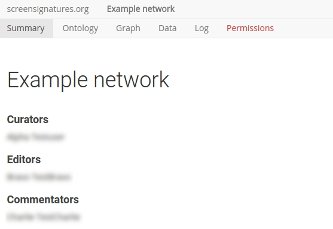

# Web interface

The root level of the web interface is a welcome page. The main purpose of the front page is to list the networks defined on the website. Because networks can be defined as public or private, the list can vary depending on the user log-in status. 

{:.p-note}
The NetworkCurator has been tested in the following browsers: Chrome, Firefox, Safari. 
Some SVG-related features may not visible in Internet Explorer/Edge.

## Network pages

Clicking on one of the network links displays summary information about the network. 

The most prominent object on the page is the network title (here 'Example network'). But there are several other noteworthy components. 

### Credits

A section below the title acknowledges the users contributing to the network data (above, names blurred). The various authorship categories are determined by [permission levels](permissions.html).

### Annotations

Below the credits are [annotations](annotations.html) for the network as a whole. This text is managed by the network curators. Below the main annotations is a [comments](commenting.html) that is accessible to other network contributors.

### Toolbar 

The toolbar provides access to other views on the network data. In particular, to network [ontologies](ontologies.html), [graph visualization](graphs.html), data [import](dataimport.html)/[export](dataexport.html), and activity logs. The tab linking to [permissions](permissions.html) configurations is only visible to users with curation rights.
