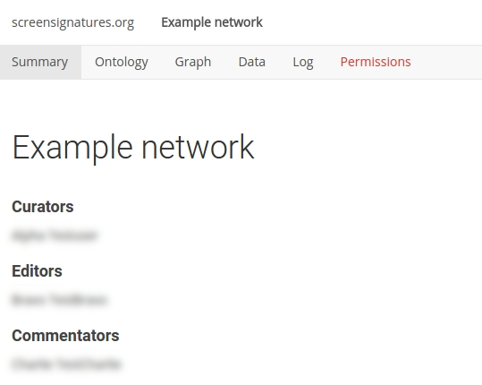

# Web interface

The root level of the web interface is a welcome page. The main purpose of the front page is to list the networks defined on the website. Because networks can be defined as public or private, the list can vary depending on the user log-in status. 

{:.p-note}
The NetworkCurator has been tested in the following browsers: Chrome, Firefox, Safari. Some SVG-related features may not visible in Internet Explorer/Edge.

## Network pages

Clicking on one of the network links displays summary information about the network. 

### Toolbar 

The network toolbar near the top of the page provides access to various views on the network data. In particular, there are links to the network [ontology](ontologies.html), [graph visualization](graphs.html), data [import](dataimport.html)/[export](dataexport.html), and activity logs. The tab linking to [permissions](permissions.html) configurations is only visible to users with curation rights.

### Title and credits

Below the toolbar is a section with a prominent title and a summary of the users contributing to the network data (above, names blurred). The various authorship categories are determined by [permission levels](permissions.html).

### Annotations

Below the credits are a network abstract and a network description. These are [annotations](annotations.html) associated with the network as a whole. Their text is managed by the network curators. 

Below the main annotations is a [comments](commenting.html) section that is accessible to other network contributors.

