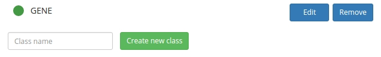

# Ontologies

The graph ontology determines the types of the nodes and links that can be represented in a given network. The ontology page is editable by users with [curator priviledges](permissions.html) and  provides tools to adjust the hierarchy of the ontology classes and their visual appearance on the graph page.

 - [Ontology class structure](#browsing) 
 - [Managing an ontology](#managing) 
 - [Styling ontology classes](#styling) 


<a name="browsing"></a>

## Ontology class structure

The graph ontology is split into components describing nodes and links. Each type of node and link is associated with a visual representation, which should be visible next to the class name.


<a name="managing"></a>

## Managing ontologies 

Users with [curator priviledges](permissions.html) can adjust the network ontology.



 - Use the small form to create a new ontology type.
 - To update a class name, click the 'Edit' button, adjust the class name, and then 'Update'.
 - Use the 'Remove' button to delete/inactivate an existing class name.
 - Click on the ontology icon (green circle above) and drag to arrange the classes into a hierarchy.

{:.p-note}
You will have to **update** the ontology classes after re-arranging them in a hierarchy. To do this, click on the 'Edit' button and then 'Update'.

{:.p-note}
The 'remove' action deletes an ontology class completely only if it has not yet been applied to any graph element. If it has, the action results in inactivation of the class. This means the class will persist in the database but will not appear by default on the graph page.


<a name="styling"></a>

## Styling ontology classes

Styling of ontology classes is achieved through a combination of scalable vector graphics (SVG) and cascading style sheets (CSS). Defining these styles can be fiddly. However, styles usually do not require frequent adjustments and the examples below provide code snippets that are ready for cut-and-paste.


### Background

Networks on the [graph](graphs.html) page rendered using scalable vector graphics (SVG). Each svg object is set up with a leading set of `defs` followed by data. Styling of nodes and links is achieved by placing custom definitions in the `defs` component.

To adjust style definitions for an ontology class, click on the `Edit` button next to the class name. This should display a form where you can change the class name in a text box and adjust styling in a larger text area. The preview on the left should provide immediate feedback as to how a style definition is actually rendered.


### Styling nodes

Nodes are positioned in the network with `use` tags that refer to shapes. In the styling text area we thus have to input a shape definition with an id. 

Let's assume that our node class is callled `NODE_X`. A minimal declaration for a circular shape is 

```
<circle id="NODE_X" cx=0 cy=0 r=10></circle>
```

A similar declaration for a rectangular node with round corners is 

```
<rect id="NODE_X" x=-9 y=-9 width=18 height=18 rx=3 ry=3></rect>
```

{:.p-note}
The shape definition **must contain an `id` tag that matches the ontology class name**. This tag is required because network elements use it to determine their shape. If you update the name of the class, you will have to manually adjust the `id` tag to match. 

{:.p-note}
The shape should be **centered around the origin, `(0, 0)`**. For circular shapes, this is easy to achieve by setting `cx=0 cy=0`. For rectangles, it is necessary to manually adjust the position of the top-left corner and the height/width properties. If the shape center is miss-specified, node elements can become invisible in the preview and appear offset on the network page. 

Both the circle and the rectangle shapes above appear in the default style and color. To fine-tune the appearance, you can add custom cascading style sheet (CSS) rules for [SVG elements](https://developer.mozilla.org/en-US/docs/Web/Guide/CSS/Getting_started/SVG_and_CSS).

```
<style type="text/css">
use.NODE_X {
  fill: #daa;
  stroke: #d22;
  stroke-width: 1;
}
</style>
<circle id="NODE_X" cx=0 cy=0 r=10></circle>
```

{:.p-note}
The CSS definitions must be within a `use` block decorated by a dot and the ontology class name (here `NODE_X`).

{:.p-note}
The CSS block must be enclosed in a `<style>` tag.

{:.p-note}
The class name must match the `id` as well as `use` elements. 

{:.p-warning}
It is also possible to write style rules directly inside the shape definitions. This works in principle, but can cause problems during selections on the graph page. 


### Styling links

Links are always rendered using `line` elements. Thus to style a link we do not need to specify a shape, only the css style. 

Let's assume a link class is called `LINK_Y`. A style definition might be

```
<style type="text/css">
line.LINK_Y {
  stroke: #09d;
  stroke-width: 5;
}
</style>
```

{:.p-note}
The CSS definitions must be within a `line` bock decorated by a dot and the name of the ontology class. If you update the name of the class, you will have to manually adjust the ontology class associated with the `line` block to match. 


In some cases it useful to encode directional relationships. For this purpose we can use line markers such as arrowheads. To achieve this, the line style box should hold definition for a marker in addition to CSS instructions for how to apply the marker to the line. 

```
<marker id="mLINK_Y" 
        markerWidth="4" markerHeight="4" 
        refX="8" orient="auto" refY="2">
    <path d="M0,0 L4,2 0,4" stroke="#d9d" fill="none"></path>
</marker>
<style type="text/css">
line.LINK_Y {
  stroke: #d9d;
  stroke-width: 4;
  marker-end: url(#mLINK_Y)
}
</style>
```

{:.p-note}
The marker object must have an `id` tag. This `id` must be referenced from the CSS block. The `id` must be a unique identifier; a simple way to achieve this is to use the ontology class name with a prefix or postfix.

{:.p-note}
Markers in CSS are styled separately from lines. Color matching between marker and line must be applied manually. 

{:.p-note}
The position of the marker along the line might appear strange in the preview diagram. In particular, the marker might appear near the middle of the line and not at the end. This is a trick to avoid having the arrowhead hidden by a large node on the graph page. 


### Examples

Styling nodes and links can be fun, but it can be tricky. Starting with a set of examples.


<style type="text/css">
use.DRUG {
  fill: #8a8;
  stroke: #242;
  stroke-width: 1;
}
</style>
<g id="DRUG" transform="rotate(-30)">
<rect x="-16" y="-8" width="32" height="16" rx="8"></rect>
<rect x="-10" y="-5" width="10" height="10" fill="#ffffff" stroke-width="0"></rect>
<circle cx="-8" cy="0" r="5" fill="#fff" stroke-width="0" ></circle>
</g>


<style type="text/css">
use.CELL {
  fill: #eee;
  stroke: #222;
  stroke-width: 1.5;
}
</style>
<g id="CELL" transform="translate(-18,-18)scale(1.2)">
    <path d="m 30.215521,24.283492 c -2.87712,5.01705 -8.564919,8.18014 -14.298109,8.35704 -3.38356,-0.10338 -6.7045503,-1.57121 -9.1959803,-3.83069 -2.38147,-2.45266 -4.2370304,-5.43965 -5.4487704,-8.62961 -0.85646002,-2.92501 -0.73355002,-6.06951 -0.18194,-9.0369 0.80104,-2.7994201 2.62221,-5.1660201 4.4070004,-7.4110697 1.59682,-1.83048 3.96391,-2.98401002 6.4167903,-2.85764002 3.36197,-0.0232 6.88335,-0.23323 10.03578,1.15361002 3.110239,1.3451 5.967609,3.4651796 7.917359,6.2559696 1.5752,2.3371301 1.94325,5.2249001 1.74046,7.9784501 -0.0208,2.71371 -0.0206,5.58623 -1.39259,8.02084 z"></path>
    <circle cx="19" cy="18" r="8.5" fill="#777" stroke-width="0.5"></circle>
  </g>


<style type="text/css">
use.Pathway {
  fill: #f4f408;
  stroke: #222;
  stroke-width: 1.2;
}
</style>
<g id="Pathway" transform="translate(-10,-18)">
    <path d="m 11.992,0.989 c -6.208,0 -11.244,4.601 -11.244,10.273 0,1.660 0.452,3.226 1.218,4.614 0.215,0.389 0.444,0.776 0.710,1.136 l 5.178,8.53 0.304,0 7.640,0 0.329,0 5.178,-8.534 c 0.103,-0.139 0.183,-0.296 0.279,-0.440 l 0.279,-0.417 c 0.054,-0.091 0.100,-0.184 0.152,-0.278 0.765,-1.387 1.218,-2.954 1.218,-4.614 0,-5.672 -5.036,-10.273 -11.244,-10.273 z"  />
    <g>
      <path d="m 8.0361,27.893 8.1355,0" stroke-width="1.4"/>
      <path d="m 8.0361,30.036 8.1355,0" stroke-width="1.4"/>
      <path d="m 8.0361,32.180 8.1355,0" stroke-width="1.4"/>
      <path d="m 9.2386,34.324 5.7304,0" stroke-width="1.4"/>
    </g>
  </g>


<style type="text/css">
use.STIMULUS {
  fill: #fd0;
  stroke: #630;
  stroke-width: 0.3;
}
</style>
<g id="STIMULUS" transform="translate(-18,-18)">
<path d="m 25.770,0.468 -14.092,13.562 5.837,0 -11.487,11.062 5.837,0 L 0.409,36.156 24.169,22.562 l -7.815,0 13.433,-11.031 -7.815,0 13.464,-11.062 -9.667,0 z" />
</g>


<style type="text/css">
use.LOGIC_AND {
  fill: #eee;
  stroke: #222;
  stroke-width: 1.5;
}
</style>
<g id="LOGIC_AND" transform="translate(-18,-18)">
    <path d="m 6.846,8.142 0,19.715 13.246,0 c 0.065,0 0.131,0 0.196,0 5.351,-0.105 9.67,-4.495 9.675,-9.871 0,-5.37 -4.323,-9.738 -9.675,-9.843 l -0.196,0 -13.246,0 z"></path>
    <g transform="matrix(0.9,0,0,0.9,-14.680,-956.572)" id="g3853">
      <path d="m 16.404,1089.384 7.336,0"></path>
      <path d="m 16.404,1076.333 7.336,0"></path>
    </g>
    <path d="m 29.923,18 6.603,0"></path>
  </g>


<style type="text/css">
use.LOGIC_OR {
  fill: #eee;
  stroke: #222;
  stroke-width: 1.5;
}
</style>
<g id="LOGIC_OR" transform="translate(-18,-18)">
    <path d="m 6.410,8.142 c 0,0 3.403,4.549 3.403,9.843 0,5.294 -3.403,9.871 -3.403,9.871 l 13.246,0 c 0.075,0 0.150,0 0.225,0 5.329,-0.110 9.315,-4.168 10.996,-9.871 -2.129,-6.375 -5.679,-9.751 -10.996,-9.843 l -0.225,0 -13.246,0 z" />
    <g transform="matrix(1.199,0,0,0.9,-19.820,-956.576)" >
      <path d="m 16.404,1089.384 7.336,0" />
      <path d="m 16.404,1076.333 7.336,0" />
    </g>
    <path d="m 30.433,17.996 5.703,0" />
  </g>
 

