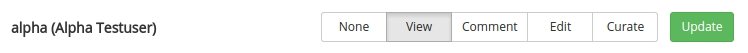

# Permissions

Permission configurations determine the extent to which individual users can interact with any particular network. The software supports several levels of interaction.

<table class="table">
<tr><th>Permission level</th><th>Browse</th><th>Comment</th><th>Create content2</th><th>Adjust content3</th><th>Manage network4</th></tr>
<tr><td>View1</td><td>yes</td><td>-</td><td>-</td><td>-</td><td>-</td></tr>
<tr><td>Comment</td><td>yes</td><td>yes</td><td>-</td><td>-</td><td>-</td></tr>
<tr><td>Edit</td><td>yes</td><td>yes</td><td>yes</td><td>own content only</td><td>-</td></tr>
<tr><td>Curate</td><td>yes</td><td>yes</td><td>yes</td><td>all content</td><td>yes</td></tr>
</table>

 1 The 'View' permission level determines whether a network is visible on the front page of the NetworkCurator site. Other permission levels manifest at various stages of interaction with the network.

2 'Create content' refers to adding nodes and links to the network graph.

3 'Adjust content' refers to the ability to modify an existing network component or comment. Users who create an object can always adjust it (to fix typos, provide more details, etc.). Curators are able to adjust content created by themselves as well as by other users.

4 'Manage network' includes abilities to adjust the network ontology and user permissions.

## New networks

By default, new networks are private. Neither the guest user (anonymous visitor) or any of the registered users have 'View' permissions. New networks are only visible to the `admin` user. 

## Managing permissions

Permission levels can be set individually for each network and for each user through the 'Permissions' page available through a tab in the navigation bar. The tab is only visible to the `admin` user and to users with curation permissions.

On the permissions page, a form at the bottom provides a means to grant 'View' access to individual users. Once this permissions are granted to the user, a widget for that user should appear on the page.

To change the permission level associated to a user, click the appropriate level and then click the 'Update' button. 

{:.p-important}
**Curator status.** The `admin` account should be reserved only to initiate the network and to assign one or more users as curators of the network. Users with curator status can then determine permission levels for all other participants in the network. 

{:.p-important}
**Public vs. private.** The permissions page can be used to make a particular network public, i.e. viewable by all users. 

