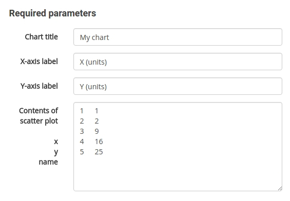
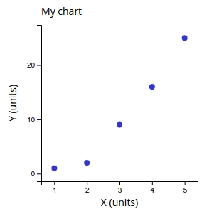

# Sandboxes 

Sandboxes are pages independent of any network. They are areas where you can experiment 
with creating content. 

## Markdown previewing

The markdown sandbox is a simple previewer when you can input markdown-formatted 
text and observe the html-formatted output. 
The functionality is similar to many other markdown previewers on the web.

## Generic makealive components

Other sandboxes help to create generic data visualizations such as bar charts,
scatter charts, or venn diagram. Each sandbox has a form where you can enter
data and tune some 

The form generates two types of output at the bottom. On the left is a text area
with text code in makealive format. On the right is a rendering of the data. 

You can copy paste the makealive code and reproduce the chart on any content page 
or comment box.

## Network-specific makealive components

Some sandboxes are set up to query the NetworkCurator database API. For example,
the `nodeneighbor` component produces venn diagrams in which one set consists
of all nodes that are linked with a query node.

## Network definitions

The final sandbox does not produce visual output. Rather, it helps produce network
definition files that can be uploaded onto the site via the [data import](dataimport.html)
feature. 

Type in definitions for network components into the text areas. Or cut-and-paste 
such definitions from a spreadsheet. The sandbox will place the information into
the correct JSON format. 

